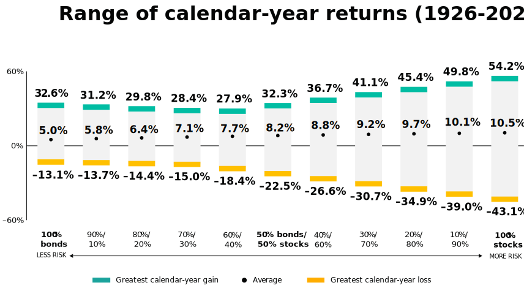

# Stocks / Bonds

## Overview

Maintaining a strategic split between stocks (equities) and bonds (fixed-income) is about balancing growth with the need for stability.

- **Stocks** - provide higher expected returns for wealth accumulation and preserving spending power but can be very volatile.
- **Bonds** - are the portfolio's anchor and shock absorber providing income and "dry-powder" for cash-flow and/or rebalancing when stocks are depressed during market downturns.

## Risk

Determining your optimal stock/bond split requires balancing two distinct dimensions of risk:

- Risk Capacity (math)
- Risk Aversion (mind)

### Risk Capacity (Math)

Risk capacity is the ability to handle market drawdowns based on your financial circumstances including net worth, investment horizon, and liquidity requirements.

As you approach the distribution phase (retirement) and begin drawing from the portfolio, your risk capacity naturally shifts because you face sequence-of-returns risk (the danger of market drops coinciding with early withdrawals).

Risk capacity may be aided by:

- **Fixed Overheads**: Having a paid-off mortgage or minimal essential spending requirements.
- **Guaranteed Income**: Social Security, pensions, etc. that cover baseline expenses.
- **Flexibility**: Employing a flexible spending strategy, utilizing a part-time income stream or adjusting a retirement timeline.

### Risk Aversion (Mind)

Also referred to as "Risk Tolerance", when a portfolio's asset allocation is mismatched with an investor's true level of risk aversion, market stress invariably exposes the flaw, leading to:

- **Distress**: Anxiety and financial worry.
- **Behavior**: Panic-selling during a market crash which locks-in paper losses into long-term capital destruction.

The ideal stock/bond allocation provides the emotional comfort required to ignore short-term market noise and remain disciplined.

## Historical Risk-Return

A table from Larry Swedroe, based on the 1970's bear market showing the amount of decline for stock/bonds:

```
| stocks/bonds     | max loss |
|------------------|----------|
| 100/0            | 50%      |
| 90/10            | 40%      |
| 80/20            | 35%      |
| 70/30            | 30%      |
| 60/40            | 25%      |
| 50/50            | 20%      |
| 40/60            | 15%      |
| 30/70            | 10%      |
| 20/80            | 5%       |
```

A chart of allocations w/ avg return, volatility (standard dev), etc. from 1926 - present:

```
| (Stocks / Bonds) | Avg Return | Volatility  | Worst Year | Best Year |
|------------------|------------|-------------|------------|-----------|
| 100 / 0          | 10.2%      | 18.5%       | -43.1%     | +54.2%    |
| 90 / 10          | 9.8%       | 16.7%       | -38.0%     | +50.1%    |
| 80 / 20          | 9.4%       | 15.0%       | -33.1%     | +45.5%    |
| 70 / 30          | 8.9%       | 13.3%       | -28.2%     | +41.1%    |
| 60 / 40          | 8.4%       | 11.7%       | -23.5%     | +36.7%    |
| 50 / 50          | 7.9%       | 10.1%       | -18.9%     | +32.3%    |
```

An older visual chart from [Vanguard](https://investor.vanguard.com/investor-resources-education/education/model-portfolio-allocation) illustrating the historical risk and return spectrum across various stock/bond allocations:



<br/>

